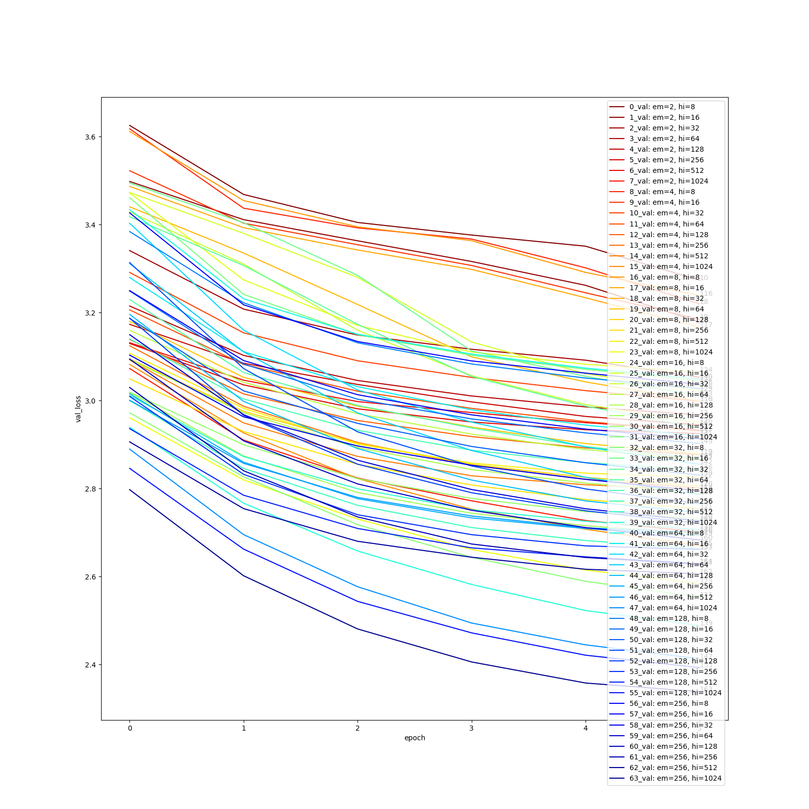
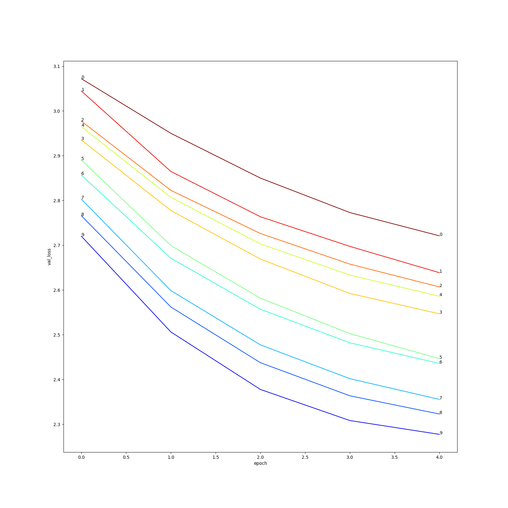
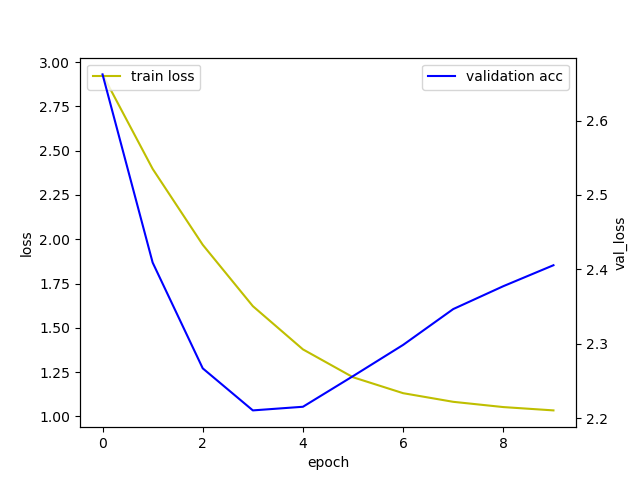

# aiffel_E04
Exploration_4, Tensorflow LSTM, create sentences from lyricist data  
AIFFEL교육과정 중 네번째 Exploration으로 lyricist데이터를 LSTM모델을 통해 문장을 만들기.


## 개요
- hyper parameters(embedding size, hidden size)찾기    
    본 시스템은 크게 3가지 단계로 이루어져 있습니다.
    1. Data pre-processing  
        - /data에 있는 문장을 가져옵니다.
        - 문장의 불필요한 부분 제거(특수문자)
        - 토큰화, 벡터화
        - data split(train, validation)
    2. Deep learning  
        -데이터를 LSTM을 통해 학습합니다.  
        -hyper parameters바꿔줍니다.
    3. result save  
        -validation loss를 plot한 결과를 저장합니다.  
        -각 model checkpoint를 저장합니다.

- 학습하기    
    본 시스템은 크게 3가지 단계로 이루어져 있습니다.
    1. Data pre-processing  
        - /data에 있는 문장을 가져옵니다.
        - 문장의 불필요한 부분 제거(특수문자)
        - 토큰화, 벡터화
        - data split(train, validation)
    2. Deep learning  
        -가장 좋았던 hyper parameters를 통해 LSTM을 학습합니다.
        -Dropout layer추가.

    3. result save  
        -validation loss를 plot한 결과를 저장합니다.  
        -validation loss가 가장 낮은 checkpoint를 저장합니다.

- 검증하기    
    본 시스템은 크게 2가지 단계로 이루어져 있습니다.
    1. Data pre-processing
        - 사용자가 원하는 앞 부분의 문장을 입력합니다.
        - 문장의 불필요한 부분 제거(특수문자)
        - 토큰화, 벡터화
    2. evaluation
        - 가장 성능이 좋았던 모델을 가지고 검증합니다.


## Installation
파이썬 개발 환경으로 최신 버전의 Anaconda를 설치하세요. (Python3 버전용)
* tensorflow (2 이상)
* matplotlib
* sckit-learn

```
$ pip install -r requirements.txt
```

------------
## Directory
필수 디렉토리는 다음과 같습니다
```
.
├── data/
│   └── lyrics/
├── module/
│   ├── generate_text.py
│   ├── model.py
│   └── preprocessing.py
├── hyper_parameter_tuning/
│   ├── model/
│   ├── result/
│   └── hyper_parameter_tuning.py
├── train/
│   ├── model/
│   ├── result/
│   └── hyper_parameter_tuning.py
├── test/
│   └── test.py
└── [E-04]_lyricist.ipyt
```

------------
### hyper parameters loss

    
| line num | embedding size | hidden size |
| --- | --- | --- |
| 0 | 2 | 8 |
| 1 | 2 | 8 |
| 2 | 2 | 8 |
| 3 | 2 | 8 |
| 4 | 2 | 8 |
| 5 | 2 | 8 |
| ~~ | ~~ | ~~ |
- 이런식으로 .csv파일형태로 나타납니다.    
- embedding size보다는 hidden size가 더 크게 미치는 것같아서 높여서 돌려봅니다.    
-----
    

    
| line num | embedding size | hidden size |
| --- | --- | --- |
| 0 | 2 | 1024 |
| 1 | 4 | 1024 |
| 2 | 8 | 1024 |
| 3 | 16 | 1024 |
| 4 | 32 | 1024 |
| 5 | 64 | 1024 |
| ~~ | ~~ | ~~ |
- 시간이 너무 오래 걸려 위의 hyper parameters와 같이 plot하지는 못 했습니다.    
- kernel이 자꾸 죽는 바람에 나눠서 검사했습니다.    
-----

    
```
Epoch 1/5
3901/3901 [==============================] - 171s 40ms/step - loss: 3.5158 - val_loss: 3.0372
Epoch 2/5
3901/3901 [==============================] - 157s 40ms/step - loss: 2.9197 - val_loss: 2.8428
Epoch 3/5
3901/3901 [==============================] - 159s 41ms/step - loss: 2.6482 - val_loss: 2.7056
Epoch 4/5
3901/3901 [==============================] - 158s 40ms/step - loss: 2.3602 - val_loss: 2.6057
Epoch 5/5
3901/3901 [==============================] - 158s 40ms/step - loss: 2.0768 - val_loss: 2.5396
Epoch 1/5
3901/3901 [==============================] - 172s 41ms/step - loss: 3.3891 - val_loss: 2.8660
Epoch 2/5
3901/3901 [==============================] - 160s 41ms/step - loss: 2.7079 - val_loss: 2.6574
Epoch 3/5
3901/3901 [==============================] - 163s 42ms/step - loss: 2.3205 - val_loss: 2.5332
Epoch 4/5
3901/3901 [==============================] - 169s 43ms/step - loss: 1.9936 - val_loss: 2.4663
Epoch 5/5
3901/3901 [==============================] - 169s 43ms/step - loss: 1.7661 - val_loss: 2.4444
Epoch 1/5
3901/3901 [==============================] - 182s 43ms/step - loss: 3.4972 - val_loss: 2.9880
Epoch 2/5
3901/3901 [==============================] - 168s 43ms/step - loss: 2.8716 - val_loss: 2.7733
Epoch 3/5
3901/3901 [==============================] - 167s 43ms/step - loss: 2.5473 - val_loss: 2.6170
Epoch 4/5
3901/3901 [==============================] - 167s 43ms/step - loss: 2.2260 - val_loss: 2.5090
Epoch 5/5
3901/3901 [==============================] - 167s 43ms/step - loss: 1.9260 - val_loss: 2.4390
Epoch 1/5
3901/3901 [==============================] - 181s 43ms/step - loss: 3.3607 - val_loss: 2.8234
Epoch 2/5
3901/3901 [==============================] - 169s 43ms/step - loss: 2.6368 - val_loss: 2.5550
Epoch 3/5
3901/3901 [==============================] - 169s 43ms/step - loss: 2.1822 - val_loss: 2.4047
Epoch 4/5
3901/3901 [==============================] - 170s 44ms/step - loss: 1.8128 - val_loss: 2.3333
Epoch 5/5
3901/3901 [==============================] - 170s 44ms/step - loss: 1.5592 - val_loss: 2.3262
Epoch 1/5
3901/3901 [==============================] - 184s 44ms/step - loss: 3.3247 - val_loss: 2.7770
Epoch 2/5
3901/3901 [==============================] - 171s 44ms/step - loss: 2.5757 - val_loss: 2.5193
Epoch 3/5
3901/3901 [==============================] - 170s 44ms/step - loss: 2.1265 - val_loss: 2.3750
Epoch 4/5
3901/3901 [==============================] - 195s 50ms/step - loss: 1.7575 - val_loss: 2.3091
Epoch 5/5
3901/3901 [==============================] - 170s 43ms/step - loss: 1.5068 - val_loss: 2.2988
Epoch 1/5
3901/3901 [==============================] - 185s 44ms/step - loss: 3.3266 - val_loss: 2.8137
Epoch 2/5
3901/3901 [==============================] - 174s 45ms/step - loss: 2.6289 - val_loss: 2.5386
Epoch 3/5
3901/3901 [==============================] - 173s 44ms/step - loss: 2.1870 - val_loss: 2.3804
Epoch 4/5
3901/3901 [==============================] - 174s 45ms/step - loss: 1.8021 - val_loss: 2.3003
Epoch 5/5
3901/3901 [==============================] - 172s 44ms/step - loss: 1.5230 - val_loss: 2.2748
Epoch 1/5
3901/3901 [==============================] - 187s 45ms/step - loss: 3.2937 - val_loss: 2.7193
Epoch 2/5
3901/3901 [==============================] - 173s 44ms/step - loss: 2.5137 - val_loss: 2.4626
Epoch 3/5
3901/3901 [==============================] - 173s 44ms/step - loss: 2.0597 - val_loss: 2.3206
Epoch 4/5
3901/3901 [==============================] - 188s 48ms/step - loss: 1.6897 - val_loss: 2.2537
Epoch 5/5
3901/3901 [==============================] - 171s 44ms/step - loss: 1.4235 - val_loss: 2.2424
Epoch 1/5
3901/3901 [==============================] - 209s 50ms/step - loss: 3.2461 - val_loss: 2.6686
Epoch 2/5
3901/3901 [==============================] - 209s 54ms/step - loss: 2.4405 - val_loss: 2.3996
Epoch 3/5
3901/3901 [==============================] - 205s 53ms/step - loss: 1.9404 - val_loss: 2.2510
Epoch 4/5
3901/3901 [==============================] - 201s 51ms/step - loss: 1.5627 - val_loss: 2.1991
Epoch 5/5
3901/3901 [==============================] - 195s 50ms/step - loss: 1.3154 - val_loss: 2.2111
Epoch 1/5
3901/3901 [==============================] - 255s 62ms/step - loss: 3.2062 - val_loss: 2.6362
Epoch 2/5
3901/3901 [==============================] - 256s 66ms/step - loss: 2.4069 - val_loss: 2.3802
Epoch 3/5
3901/3901 [==============================] - 253s 65ms/step - loss: 1.9107 - val_loss: 2.2439
Epoch 4/5
3901/3901 [==============================] - 250s 64ms/step - loss: 1.5445 - val_loss: 2.2008
Epoch 5/5
3901/3901 [==============================] - 244s 62ms/step - loss: 1.2997 - val_loss: 2.2149
```
    
| line num | embedding size | hidden size |
| --- | --- | --- |
| 0 | 2 | 2048 |
| 1 | 4 | 2048 |
| 2 | 8 | 2048 |
| 3 | 16 | 2048 |
| 4 | 32 | 2048 |
| 5 | 64 | 2048 |
| ~~ | ~~ | ~~ |
9번째일 때 가장 낮게 나옴.
- 시간이 너무 오래 걸려 위의 hyper parameters와 같이 plot하지는 못 했습니다.    
- kernel이 자꾸 죽는 바람에 나눠서 검사했습니다.  
  -Resource exhausted: OOM when allocating tensor with shape[1024,2048] 발생  
-----
    
### loss


- hyper parameters tuning에서는 시간이 오래 걸려 epoch을 5~6으로 한 것을 10으로 변경했습니다.    
-----
  
### result


------------
## 차별점, 문제점
1. 이전에는 hyper parameters를 찾기위해 하나씩 돌려봤다면 이번에는 여러개의 hyper parameters를 돌려 최적의 값을 찾도록 했습니다. 
- 시간이 너무 오래 걸림   
2. 같이 사용하는 코드는 함수로 만들었습니다. 
3. hyper parameters tuning을 할 때마다 checkpoint로 저장했는데 다 저장하지 5GB를 넘겨 train만 저장해야겠습니다.   
4. hyper같이 사용하는 함수를 모듈로 만들어 반복해 사용하는 
5. CV에 관심이 있어 NLP에 대한 관심이 떨어져 loss값을 더 줄일 수 있을 것 같은데 미흡한 점  
- padding값과 maxlen이 성능에 미치는 영향   
- aiffel에서 올라온 반복되는 단어에 대한 처리   
6. 마지막에 커널이 초기화되면서 정리할 시간이 부족해 마무리를 제대로 못 한 점이 매우 아쉽게 느껴졌습니다.
